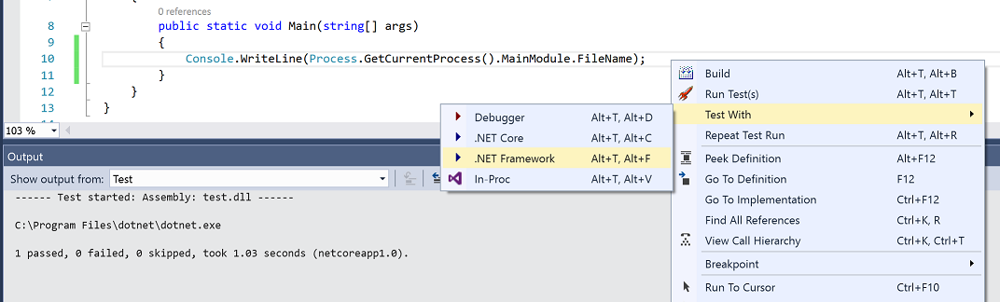

# TestDriven.Net 4

## The latest build of TestDriven.Net 4.0-beta2 is available: http://testdriven.net/download.aspx - [release notes](https://github.com/jcansdale/TestDriven.Net-Issues/blob/master/ReleaseNotes.md)

### It includes support for .NET Core and Visual Studio "15" preview versons.

project.json / .xproj support works as follows:

- `'Run Test(s)'` and `'Test With > Debugger'` will run or debug using the first framework defined in `project.json`
- `'Test With > .NET Core'` will run using the first defined .NET Core framework (e.g. `netcoreapp1.0`) 
- `'Test With > .NET Framework'` will use the first non-Core framework defined in `project.json` (e.g. `net35` or `net451`)
- If a `testRunner` is defined, .NET Core and .NET Framework tests will be executed using `dotnet-test-xunit` or `-nunit`.

I've added some example .NET Core and multi-framework projects to this repo:
https://github.com/jcansdale/TestDriven.Net-Issues/tree/master/ExampleProjects/xproj
 
I'm experimenting using this repository for public issue tracking. The rest of TestDriven.Net is managed inside a private repository, but unfortunately there isn't the option to make those issues public. I'm tracking a few issues here instead.

Feel free to add [issues](https://twitter.com/jcansdale), feature [suggestions](https://twitter.com/jcansdale) or tweet me!

Jamie Cansdale

